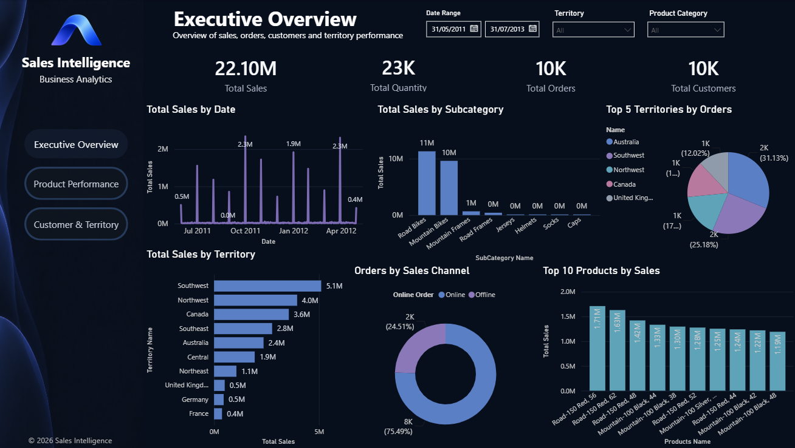
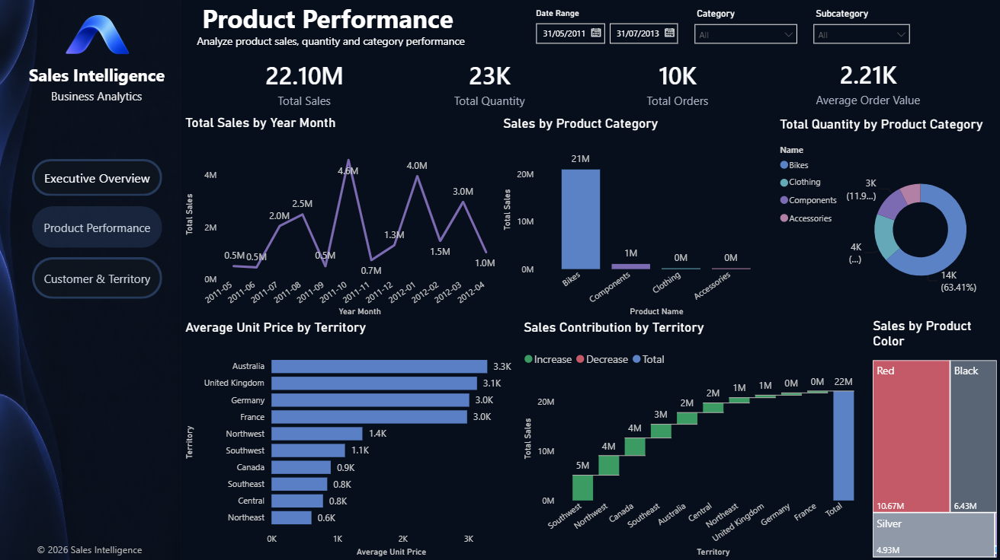
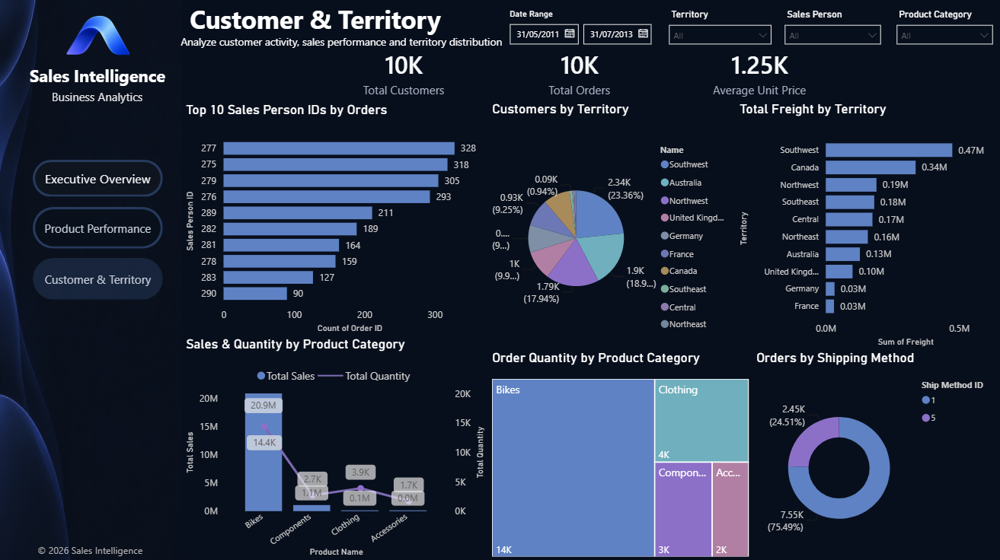

# Sales Intelligence Dashboard

An interactive Power BI dashboard built to provide a clear and practical view of sales performance across products, customers, orders, and territories.

The project uses the AdventureWorks sample dataset and presents the analysis through three interactive dashboard pages, allowing users to explore key business metrics, sales trends, product performance, customer activity, and regional performance.

---

## Project Overview

The Sales Intelligence Dashboard was developed to turn transactional sales data into a clear and easy-to-use business reporting solution.

The dashboard brings together information from sales orders, products, customers, and territories to provide a consolidated view of business performance.

It is designed for users who need to quickly understand current sales performance, identify trends, compare different business areas, and explore the data through interactive filters and visualizations.

---

## Business Objectives

The main objectives of the dashboard are to:

- Monitor overall sales performance and order activity.
- Track total sales, quantity, orders, and customers.
- Identify sales trends over time.
- Compare product categories and subcategories based on sales and quantity.
- Analyze sales performance across different territories.
- Identify top-performing products.
- Analyze customer distribution across territories.
- Compare online and offline order activity.
- Review sales person performance based on order activity.
- Analyze freight and shipping activity by territory and shipping method.
- Provide an interactive reporting experience through filters and visualizations.

---

## Dataset

The project uses the **AdventureWorks** sample dataset.

AdventureWorks is a sample sales database containing information related to customers, products, sales orders, sales order details, product categories, product subcategories, and sales territories.

The dataset was retrieved through the LearnSQL AdventureWorks API and imported into Power BI for data preparation, modeling, analysis, and visualization.

---

## Data Sources

The following source tables were used to build the dashboard:

| Table | Purpose |
|---|---|
| `Sales_SalesOrderHeader` | Contains order-level information such as order date, customer, territory, tax, freight, and sales channel. |
| `Sales_SalesOrderDetail` | Contains order line information including products, quantities, unit prices, and line totals. |
| `Production_Product` | Contains product information used for product-level analysis. |
| `Production_ProductSubcategory` | Contains product subcategory information used to analyze product performance. |
| `Production_ProductCategory` | Contains product category information used for category-level analysis. |
| `Sales_Customer` | Contains customer information used for customer analysis. |
| `Sales_SalesTerritory` | Contains territory information used for regional and geographical analysis. |

### Source API

The data was retrieved from the LearnSQL AdventureWorks API.

The source endpoints used for the project are documented in the repository under the `Data/` folder.

---

## Data Preparation

The source data was imported into Power BI and prepared for analysis.

The preparation process included:

- Connecting Power BI to the AdventureWorks API endpoints.
- Importing the required sales, product, customer, and territory tables.
- Reviewing the imported data and column structure.
- Preparing the tables for analysis and visualization.
- Creating relationships between the relevant tables.
- Creating a dedicated date table for time-based analysis.
- Creating calculated measures using DAX for the main business KPIs.
- Organizing the model to support interactive filtering across the dashboard pages.

---

## Data Model

The Power BI data model connects sales transactions with the relevant product, customer, territory, and date information.

The model includes:

- Sales order header information.
- Sales order detail information.
- Product information.
- Product subcategory and category hierarchies.
- Customer information.
- Sales territory information.
- A dedicated date table for time-based analysis.

This structure allows users to analyze sales performance from different business perspectives while maintaining consistent filtering across the dashboard.

---

## Dashboard Pages

The dashboard consists of three main pages.

### 1. Executive Overview

The Executive Overview provides a high-level summary of overall business performance.

It includes:

- Total Sales
- Total Quantity
- Total Orders
- Total Customers
- Sales trends over time
- Sales by product subcategory
- Top territories by orders
- Sales by territory
- Online vs. offline orders
- Top products by sales

This page is designed to give users a quick overview of the overall sales situation.

---

### 2. Product Performance

The Product Performance page focuses on product and category analysis.

It includes:

- Total Sales
- Total Quantity
- Total Orders
- Average Order Value
- Sales by year and month
- Sales by product category
- Quantity by product category
- Average unit price by territory
- Sales contribution by territory
- Sales by product color

This page helps users understand which products and categories contribute most to overall sales performance.

---

### 3. Customer & Territory

The Customer & Territory page provides a more detailed view of customer activity and regional performance.

It includes:

- Total Customers
- Total Orders
- Average Unit Price
- Top sales person IDs by orders
- Customer distribution by territory
- Total freight by territory
- Sales and quantity by product category
- Order quantity by product category
- Orders by shipping method

This page helps identify differences in customer activity, territory performance, and order distribution.

---

## Dashboard Preview

### Executive Overview



### Product Performance



### Customer & Territory


---

## Key KPIs

The dashboard includes the following key performance indicators:

| KPI | Description |
|---|---|
| **Total Sales** | Total sales value generated from the available order details. |
| **Total Orders** | Number of unique sales orders. |
| **Total Quantity** | Total quantity of products ordered. |
| **Total Customers** | Number of unique customers. |
| **Average Order Value** | Average sales value per order. |
| **Total Tax** | Total tax amount associated with the selected orders. |
| **Online Orders** | Number of orders placed through the online sales channel. |
| **Offline Orders** | Number of orders placed through the offline sales channel. |

The DAX measures used to calculate these KPIs are documented separately in the `DAX/` folder.

---

## Interactive Features

The dashboard includes interactive filters that allow users to explore the data based on different business dimensions.

Depending on the dashboard page, users can filter the analysis by:

- Date range
- Territory
- Product category
- Product subcategory
- Sales person
- Other available business dimensions

The visuals update dynamically based on the selected filters, allowing users to explore specific areas of interest.

---

## Tools & Technologies

- **Microsoft Power BI** — Dashboard development, data modeling, and visualization.
- **Power Query** — Data connection and preparation.
- **DAX** — Business calculations and KPI measures.
- **AdventureWorks** — Sample sales dataset.
- **LearnSQL API** — Source used to retrieve the AdventureWorks data.

---

## Project Structure

```text
Sales-Intelligence-Dashboard/
│
├── README.md
│
├── Sales Performance Dashboard.pbix
│
├── DAX/
│   └── DAX-Measures.md
│
├── Data/
│   └── Source data and dataset references
│
└── Screenshots/
    ├── Executive-Overview.png
    ├── Product-Performance.png
    └── Customer-Territory.png
```

---

## DAX Measures

The main DAX measures created for the dashboard are documented separately to keep the project structure organized.

You can find them here:

`DAX/DAX-Measures.md`

The file contains the measures used for:

- Sales
- Orders
- Quantity
- Customers
- Average Order Value
- Tax
- Online Orders
- Offline Orders
- Date analysis

---

## Data Source Documentation

The `Data/` folder contains the source information used for the dashboard.

The project uses the following AdventureWorks tables:

- `Sales_SalesOrderHeader`
- `Sales_SalesOrderDetail`
- `Production_Product`
- `Production_ProductSubcategory`
- `Production_ProductCategory`
- `Sales_Customer`
- `Sales_SalesTerritory`

The source endpoints are maintained separately so that the origin of the data used in the Power BI model remains clear and easy to reference.

---

## Project Purpose

This project demonstrates the process of building a complete business intelligence dashboard, starting from an external dataset and ending with an interactive Power BI reporting solution.

It covers:

- Data sourcing
- Data preparation
- Data modeling
- DAX calculations
- KPI development
- Data visualization
- Interactive dashboard design
- Business-focused data analysis

The goal is to present complex sales information in a simple and useful format that can support business analysis and decision-making.

---

## Author

**Aljohra**

Power BI | Data Analysis | Business Intelligence
